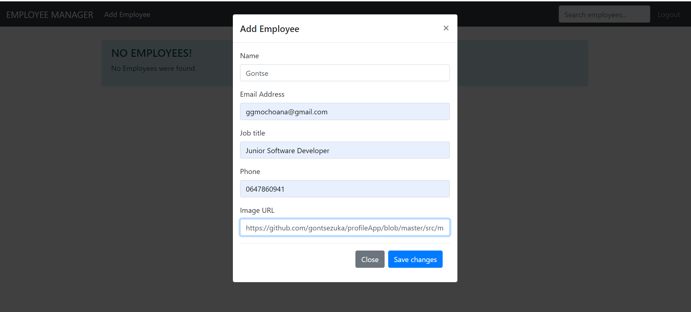

# Employee Manager Angular Angular

## This is an Angular Web Application 

## Demontrates the connections of Different TECH STACKS

## This project communicates with the SPRING BOOT BACKEND through REST API

## Link to SPRING BOOT backend application - https://github.com/gontsezuka/EmployeesBackend

## This project has a second FrontEnd written in ANDROID JAVA which also communicates with the same SPRING BOOT backend as this application.

## Link to second ANDROID FRONTEND of EMPLOYEE MANAGER. - https://github.com/gontsezuka/AndroidEmployeeFrontEnd

